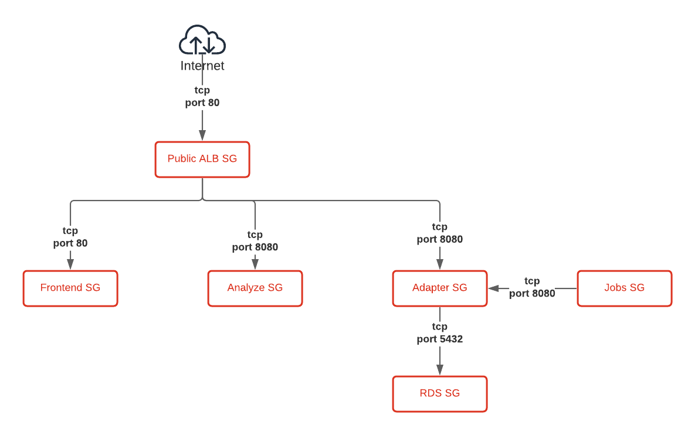
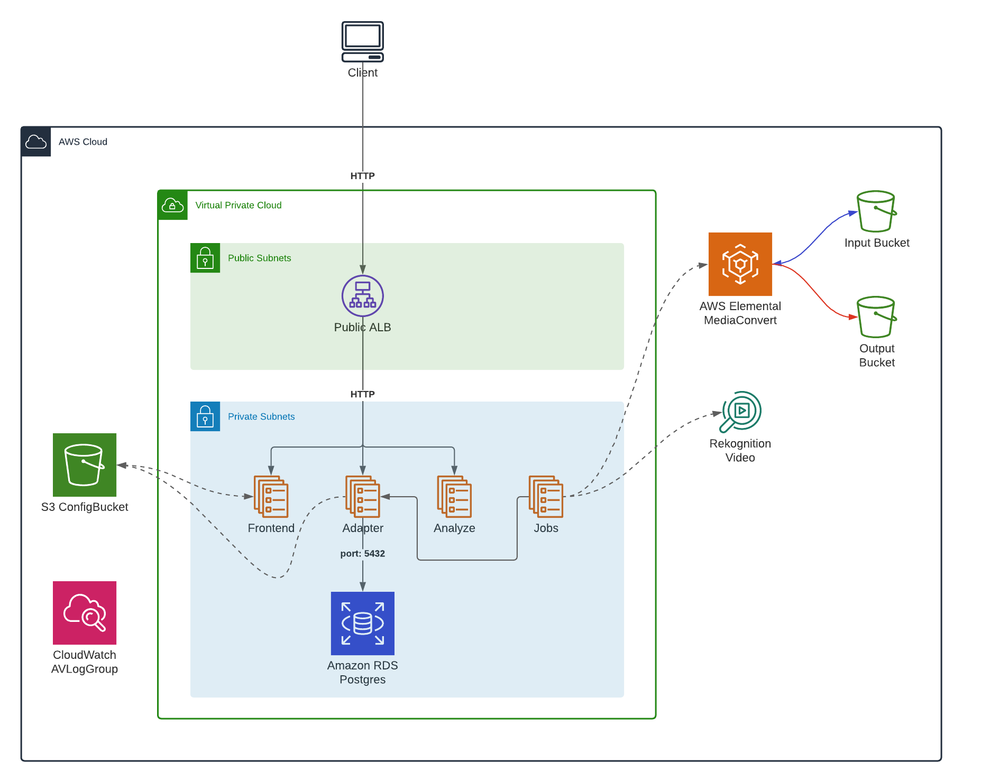

# Accurate Video on AWS ECS

## Usage

### Prerequisites

- Install [AWS CLI](https://aws.amazon.com/cli/)
- [Configure CLI](https://docs.aws.amazon.com/cli/latest/userguide/cli-configure-quickstart.html)
- Add image repository credentials to [Secrets Manager](https://aws.amazon.com/secrets-manager/)

### Create ECS cluster running Accurate Video

You can either manually upload the templates to Cloud Formation or use our interactive script that bootstraps a new ECS cluster running Accurate Video.

```sh
./deploy.sh
```

## Architecture

#### VPC


#### Security Groups


### Services


### Auto-deployment of settings file


## Configuration

The Frontend, Adapter and Jobs applications currently loads configuration files from an S3 storage that is created by the infrastructure template. We've included templates for these files in the [config directory](./config) that you can use as your base of creating the proper configuration.

Before uploading each configuration file, you need to remove the `_template` suffix from the file name, and replace or set the values that are needed for your deployment.

- `config/frontend/keycloak.json` is needed if you're using Keycloak as your authentication solution, in it you'll need to replace `AV_KEYCLOAK_URL` with the URL of your Keycloak Realm.
- `config/frontend/settings.js` contains the frontend configuration, in it you'll need to replace `AV_LICENSE_KEY` with a valid Accurate Video license key, and configure the behaviour of the application.
- `config/backend/cluster.xml` contains a Hazelcast configuration that is shared between Adapter and Jobs to talk over an event bus instead of using a polling mechanism.

After you've renamed and updated the configuration files you'll need to upload them to the configuration bucket that was created by the infrastructure template.

```sh
aws s3 cp --recursive ./config/frontend s3://${CONFIG_BUCKET}/frontend
aws s3 cp --recursive ./config/backend s3://${CONFIG_BUCKET}/backend
```
