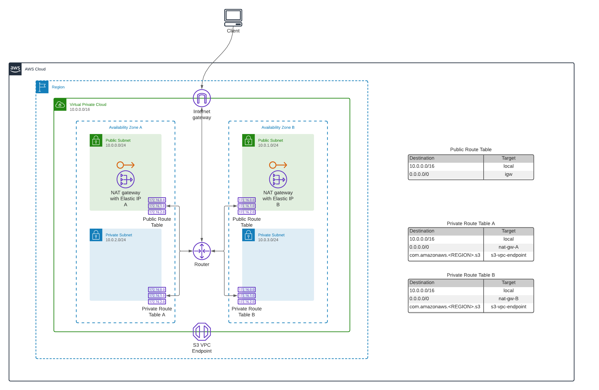
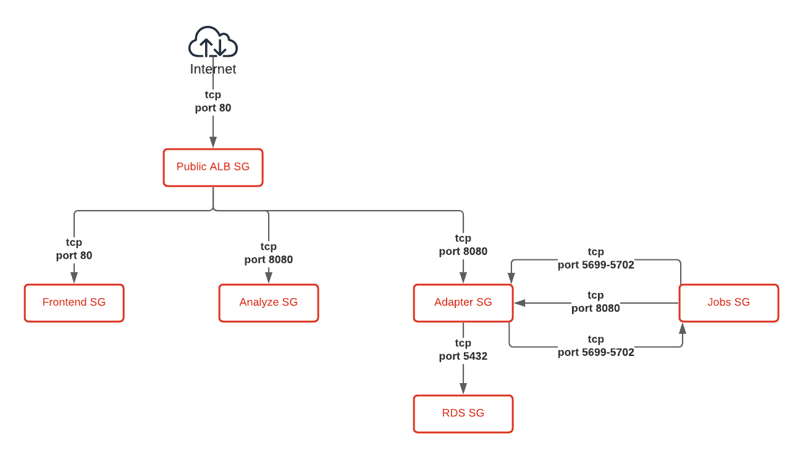

# Accurate Video on AWS ECS

## Usage

### Prerequisites

- Install [AWS CLI](https://aws.amazon.com/cli/)
- [Configure CLI](https://docs.aws.amazon.com/cli/latest/userguide/cli-configure-quickstart.html)
- Add image repository credentials to [Secrets Manager](https://aws.amazon.com/secrets-manager/)

### Configuration

The Frontend, Adapter and Jobs applications currently loads configuration files from an S3 storage that is created by the infrastructure template. We've included templates for these files in the [config directory](./config) that you can use as your base of creating the proper configuration.

Before uploading each configuration file, you need to remove the `_template` suffix from the file name, and replace or set the values that are needed for your deployment.

- `config/frontend/keycloak.json` is needed if you're using Keycloak as your authentication solution, in it you'll need to replace `AV_KEYCLOAK_URL` with the URL of your Keycloak Realm.
- `config/frontend/settings.js` contains the frontend configuration, in it you'll need to replace `AV_LICENSE_KEY` with a valid Accurate Video license key, and configure the behaviour of the application.
- `config/backend/cluster.xml` contains a Hazelcast configuration that is shared between Adapter and Jobs to talk over an event bus instead of using a polling mechanism.

After you've renamed and updated the configuration files you'll need to upload them to the configuration bucket that was created by the infrastructure template.

If you're manually applying each template and not using `deploy.sh` you also need to upload the files to the configuration bucket:

```sh
aws s3 cp --recursive ./config/frontend s3://${CONFIG_BUCKET}/frontend --profile codemill
aws s3 cp --recursive ./config/backend s3://${CONFIG_BUCKET}/backend --profile codemill
```

### Create ECS cluster running Accurate Video

You can either manually upload the templates to Cloud Formation or use our interactive script that bootstraps a new ECS cluster running Accurate Video.

```sh
./deploy.sh
```

## Architecture

### VPC
The VPC is set up with two public and two private subnets spanning two availability zones for high availability. Resources placed in the public subnets can be assigned public IP addresses, while the ones in the private subnets can not and they are only accessible from within the VPC. 

All traffic to and from the internet passes through the Internet Gateway. Access to the internet from the private subnets is done via NAT Gateways placed in both public subnets.
Traffic with an S3 bucket as destination will not be routed over the public internet, but instead via an S3 Gateway Endpoint directly over the AWS backbone network.



### Security Groups
Security groups are in place to restrict network access to the different resources. The only one that allows direct access from the internet is the public Application Load Balancer (ALB), and this is restricted to TCP traffic on port 80 as we are currently running HTTP.

The Frontend, Analyze and Adapter services allow TCP traffic coming from the public ALB to their respective ports, the Adapter service also allows TCP traffic coming directly from the Jobs service. The RDS database only allows TCP traffic on port 5432 (PostgreSQL) coming from the Adapter service.



### Services


### Auto-deployment of settings file
It is possible to change the Frontend configuration by updating the configuration file in S3. When this file is changed, S3 will send a notification event to an SNS Topic, which in turn will notify a Lambda function that initiates a new deployment of the Frontend service with the latest configuration. The deployment will launch new tasks in Fargate, wait for them to be healthy and then terminate the old tasks.


